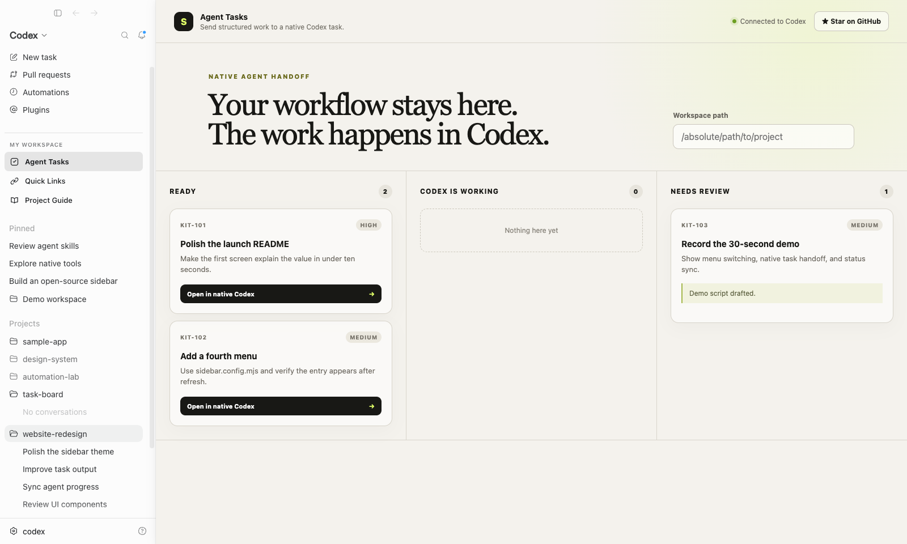

# Codex Sidebar Kit

<p align="center">
  <strong>English</strong> · <a href="./README.zh-CN.md">简体中文</a>
</p>

**Turn Codex Desktop into your own AI workspace.**

[](LICENSE)




<p align="center"><sub>Multiple menus · Native Codex handoff · Skill-powered sync</sub></p>

Codex Sidebar Kit is an unofficial, configuration-driven starter for building Web apps that live inside the Codex Desktop sidebar. A menu can display a local tool, read the current Codex context, prepare work in the **native Codex composer**, and let a Codex Skill write results back to the app.

> This project is not affiliated with or endorsed by OpenAI. Sidebar injection and native-composer handoff use undocumented Codex Desktop internals and may require compatibility updates after Codex releases.

## Why this exists

Most Codex extensions stop at a theme, quota widget, or separate CLI agent. This starter targets a more useful loop:

```text
Your Web app
  → custom Codex sidebar menu
  → native Codex task
  → native agent follows your Skill
  → your app receives status and results
```

No hidden `codex exec` process is used for the handoff. Work is prepared and displayed in the Codex App.

## What works today

- One config creates multiple first-class sidebar menus.
- Menus can use independent routes and capability allowlists.
- Iframes load lazily and keep their page state while switching.
- The Web bridge reads Codex project/thread context.
- A menu can select a workspace and prefill a native Codex task.
- `sidebarctl` lets the native agent update task status, comments, and `CODEX_THREAD_ID`.
- `npm run codex` installs configured Skills and passes the local CLI/API environment to native tasks.
- Demo task state persists in `.data/demo-tasks.json` across restarts.
- A three-menu demo shows Agent Tasks, Quick Links, and Project Guide.

The signed one-click `.dmg`, scaffold command, and native Automation adapter are planned next; they are not claimed as complete.

## 60-second preview

Requirements:

- macOS
- Node.js 22+
- Codex Desktop or ChatGPT Desktop installed

Run the Web preview:

```bash
npm run dev
```

Open <http://127.0.0.1:43119/app/tasks>.

Run inside a new Codex Desktop window:

```bash
npm run codex
```

The command starts the local example, launches a separate Codex process with an isolated profile and loopback debugging, and injects all configured menus. Your existing Codex window can remain open. Keep the terminal process running.

To attach to a Codex instance that already exposes CDP:

```bash
npm run dev
npm run inject -- --port 9229
```

## Configure multiple menus

Edit [`sidebar.config.mjs`](sidebar.config.mjs):

```js
export default {
  appId: "my-workspace",
  name: "My Workspace",
  sectionLabel: "My Tools",
  menus: [
    {
      id: "tasks",
      label: "Agent Tasks",
      icon: "check-square",
      path: "/app/tasks",
      capabilities: ["context", "native-task", "open-thread"],
      skill: "skills/sidebar-tasks",
    },
    {
      id: "links",
      label: "Quick Links",
      icon: "link",
      path: "/app/links",
      capabilities: ["context"],
    },
  ],
};
```

Current icons are `check-square`, `link`, `book-open`, and `panel-left`.

## Use the Web bridge

```js
import { codex } from "/bridge.js";

const context = await codex.context.get();

await codex.native.prepareTask({
  workspace: "/absolute/path/to/project",
  prompt: "[$my-skill] Process task APP-123 and keep its status in sync.",
});

await codex.native.openThread("native-codex-thread-id");
```

Capabilities are declared per menu. A links-only page does not automatically receive permission to prepare native tasks.

## Connect the native agent back to your app

`npm run codex` links configured Skills into `~/.agents/skills` when the name is available. It leaves an existing, unrelated Skill untouched. The launched Codex process receives `SIDEBAR_KIT_CLI_PATH` and `SIDEBAR_KIT_URL`, so native tasks can call the bundled CLI without a global npm install.

The example Skill instructs Codex to follow this loop:

```text
task get
→ task move in_progress
→ do and verify the work
→ task comment
→ task move in_review
```

The CLI writes `CODEX_THREAD_ID` with task mutations, so the Web app can reopen the corresponding native conversation.

OpenAI's official documentation describes Skills as instruction-and-resource folders that teach Codex repeatable workflows. This project uses that documented layer for the workflow; the sidebar compatibility layer remains explicitly unofficial. See [OpenAI: Skills](https://developers.openai.com/plugins/concepts/skills).

## Architecture

```text
sidebar.config.mjs
        │
        ▼
CDP injector ── creates N Codex sidebar menus
        │
        ▼
sandboxed Web routes ── bridge.js ── native Codex composer
        │                                  │
        └──── local task API ◀── sidebarctl + Skill
```

Key directories:

```text
runtime/    injected sidebar runtime
scripts/    launcher, injector, CLI, direct-path check
server/     local example API and static host
web/        three-menu example
skills/     native agent workflow template
```

## Direct-path check

```bash
npm run check
```

This validates the current vertical slice: config parsing, three generated menu definitions, injection source generation, local API startup, and task status/thread attribution.

## Roadmap

- [ ] Verify the injected UI against the current public Codex Desktop release.
- [ ] Package a signed, notarized macOS launcher with no Node.js requirement.
- [ ] Add `npm create codex-sidebar-app@latest`.
- [ ] Generate branded menus, Skills, and release workflows from one config.
- [ ] Add an experimental native Codex Automation adapter.
- [ ] Publish the compatibility matrix and 30-second demo.

## License and clean implementation

Apache-2.0. This repository is an independent implementation. It does not modify or redistribute the Codex application, `app.asar`, OpenAI assets, or another project's injector source.

If the idea is useful, star the repository and share the Codex version you tested—it directly helps prioritize compatibility work.
